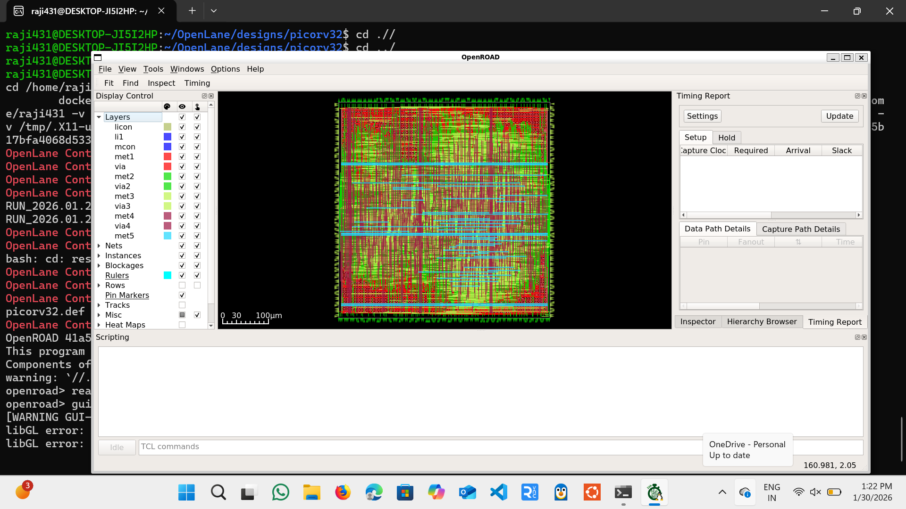

# picoRV32 OpenLane Physical Design

## Overview
This project demonstrates the physical design implementation of the picoRV32 RISC-V processor core using the OpenLane open-source ASIC flow and the SKY130 technology node.

The objective of this project is to understand and execute the complete RTL-to-layout flow, including synthesis, floorplanning, placement, clock tree synthesis, and routing.

---

## Design Details
- **Core**: picoRV32
- **ISA**: RISC-V (RV32I)
- **RTL Source**: picoRV32 open-source repository
- **Technology Node**: SKY130 (130nm)
- **Design Flow**: RTL → GDS (up to routing stage)

---

## Tools Used
- OpenLane  
- OpenROAD (GUI for layout visualization)  
- SKY130 PDK  

> Note: Layout visualization was performed using OpenROAD GUI.

---

## Physical Design Flow
The following stages were successfully completed:

1. RTL Synthesis  
2. Floorplanning  
3. Placement  
4. Clock Tree Synthesis (CTS)  
5. Routing  

---

## Results & Screenshots

### 1. Synthesis, Floorplan, and Placement

### 2. Routing Stage

### 3. Final Layout View (OpenROAD)

---

## Learning Outcomes
- Hands-on experience with OpenLane physical design flow  
- Understanding of standard cell placement and routing  
- Exposure to OpenROAD GUI for layout inspection  
- Practical knowledge of SKY130 open-source PDK  

---

## Author
Rajyalakshmi

