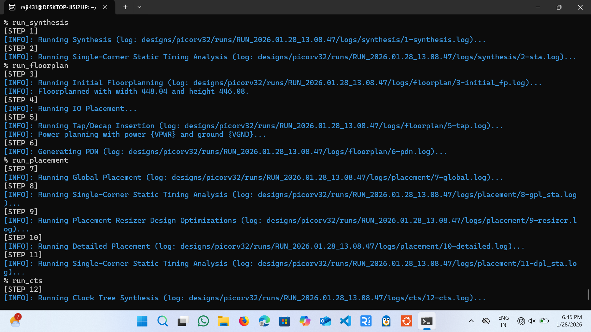

# PicoRV32 Physical Design using OpenLane (Sky130)

## 📌 Project Overview

This project demonstrates the complete RTL-to-GDSII physical design flow of the PicoRV32 RISC-V core using the OpenLane ASIC flow with the Sky130 PDK.

The design was taken from RTL, synthesized, floorplanned, placed, clock-tree synthesized, routed, and taken through full signoff to generate the final GDSII layout.

---

## 🛠️ Tools Used

- OpenLane
- OpenROAD
- Magic
- KLayout
- Sky130 PDK

---

## 🔄 Design Flow

The following stages were completed:

1. RTL Synthesis
2. Floorplanning
3. Placement
4. Clock Tree Synthesis (CTS)
5. Routing
6. Signoff (DRC/LVS)
7. GDSII Generation

---

## 📂 Project Structure
picorv32-openlane-physical-design/
│
├── rtl/
│   └── picorv32.v
│
├── gds/
│   ├── picorv32.gds
│   ├── picorv32.lib
│   ├── picorv32.lyp
│   └── picorv32.sdf
│
├── reports/
│   └── timing_summary.txt   (we will create this cleanly)
│
├── docs/
│   ├── 01_synthesis_floorplan_placement.png
│   ├── 02_routing_stage.png
│   └── 03_final_gds_layout.png
│
├── config.json
│
└── README.md
---

## 📊 Results Summary

- Technology Node: Sky130 (130nm)
- Flow: OpenLane RTL-to-GDSII
- Signoff: Completed
- Final GDS generated successfully

---

## 🖼️ Design Screenshots

### Synthesis, Floorplan & Placement

### Routing Stage

### Final GDS Layout

---

## 🎯 Conclusion

This project demonstrates hands-on experience with the complete ASIC physical design flow using industry-standard open-source tools.

It includes RTL analysis, timing verification, physical implementation, and final GDSII generation.

---

## 👩‍💻 Author

Rajyalakshmi  
VLSI Physical Design Enthusiast
